## TA Python Tools

This is a plugin which tries hard to make Unreal Editor Tools As Easy As Possible.

<a href="https://tacolor.xyz/pages/TAPython.html">TAPython WebSite</a>

<a href="https://www.tacolor.xyz/tapython/welcome_to_tapython.html">TAPython Documentation</a>

## Overview

TAPython is an editor plugin for Unreal Engine. It provides a framework for creating python editor tools in Unreal Engine, and live Slate editing for developers, which makes creating menus and UE native Slate UI much easier and faster(without any compiling time or restart editor). The plugin also provides 200+ editor tool interfaces to use, making developing UE editor tools very simple and efficient.

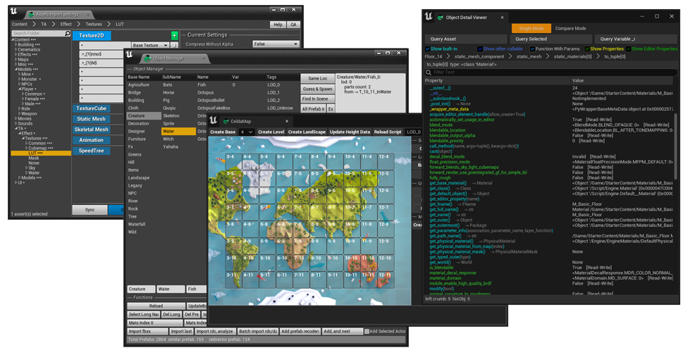

Thank you, TAPython's stargazers✨.😄

[](https://star-history.com/#cgerchenhp/UE_TAPython_Plugin_Release&Date)

## What's New


### [In latest v1.0.11](https://github.com/cgerchenhp/UE_TAPython_Plugin_Release/releases/tag/v1.0.11-ue5.2.0)

#### Add Support for UE 5.2

#### Documentation

In the past two months, TAPython has completed the update of the initial version of the document, and the subsequent documents will be iterated on the existing basis.

The document address in the plugin is updated to the new url: https://www.tacolor.xyz/tapython/welcome_to_tapython.html


#### Slate

- Add "Modal Window", available options: InitTabSize, SizingRule (UserSized, FixedSize, Autosized), TabLabel, SupportsMinimize, SupportsMaximize, IsFloatingWindow. For details, please refer to: [Modal Window](https://www.tacolor.xyz/tapython/modal_window.html)

##### Add

- Add the "%SelectionType" field to the OnSelectionChanged of SComboBox. Valid values for the field are: "OnKeyPress", "OnNavigation", "OnMouseClick", "Direct"
- Add support for Font in SMultiLineEditableTextBox
- Add support for ForegroundColor in SMultiLineEditableTextBox
- Add support for ColorAndOpacity in SMultiLineEditableText
- Add support for Font in SEditableTextBox
- Add support for ColorAndOpacity in SEditableTextBox
- Add support for TextStyle in SEditableText, SEditableTextBox, SMultiLineEditableText, and SMultiLineEditableTextBox
- Add support for VAlign and HAlign in SGridPanel
- Add support for BackgroundColor in SEditableTextBox and SMultiLineEditableTextBox

##### Fix

- Set the default `VAlign` of the middle element in SHeader to `Center`
- Set the maximum refresh rate for `OnTick` to 60hz
- Modify the log level when some Widget properties are missing
- Fix the false warning of unhandled `VAlign` and `HAlign` in SCanvas

#### Default Resources

- Add ModalWindow example resource "./ChameleonGallery/example_modal_window.json"
- Remove the "IsModalWindow" field originally in "ChameleonGallery.json". This field will be exclusively used for "ModalWindow"
- Add "DisUnrealStub.py" to separate the huge unreal.py Stub file into individual files by class for easier viewing and code completion in PyCharm and similar tools, see [here](http://tacolor.xyz/tapython/auto_complete_for_tapython.html#python-code)
- Modify the default size of Chameleon Sketch to avoid scrollbar's flicker in some cases

#### ChameleonData

- Add `unreal.ChameleonData.snapshot_sketch` command for capturing the current Sketch panel
- Add `chameleon_data_instance.get_top_scroll_box_offsets(json_path)` for getting the offset of the top scroll box in Chameleon Tool.
- Add `chameleon_data_instance.get_scroll_box_offsets(aka_name)` for getting the offset of the scroll box in Chameleon Tool with the given name.

- `chameleon_data_instance::set_image_from_path(aka_name, image_file_path)` supports using absolute paths
- Add SetMinAspectRatio/SetMaxAspectRatio for SBox
- Add `chameleon_data_instance.set_min_aspect_ratio` and `chameleon_data_instance.set_max_aspect_ratio` for setting the min/max aspect ratio of the given SBox

#### Python Editor API

##### Add

- Add `unreal.PythonBPLib.get_class_path_name` for getting the path name of the given object's class
- Add `unreal.PythonBPLib.get_viewport_linear_color_pixels` for getting the pixels of the viewport as a linear color array
- `unreal.PythonBPLib.exec_python_command`, add `force_game_thread` option to allow Python code to execute on the main thread. When we execute code in a sub-thread, if we need to modify the UI content, we can specify to modify it in the main thread through the `force_game_thread` option (the UI content can only be modified in the Game thread).

##### Fix

- Fix the issue with the incorrect IsAltDown behavior in `unreal.PythonBPLib.get_modifier_keys_state()`

### In v1.0.10


The Intermediate directory is added to the package and includes UnrealEditor-TAPython.lib (UE4Editor-TAPython.lib in UE4) to make compatibility with the automated build system. At the same time, add the corresponding .dll for DebugGame mode.

#### Slate

##### Add support for SWebBrowser

Adding support for SWebBrowser allows you to embed WebBrowser in the tool window, which can be helpful in some situations, such as embedding the internal pipeline tool in the python tool in Unreal Editor.

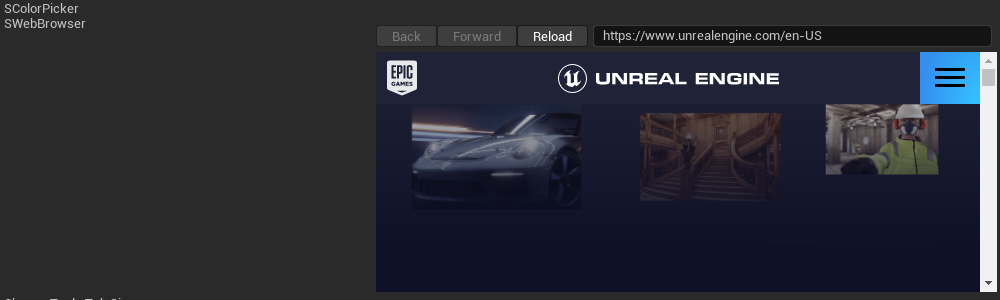


Using the SWebBrowser widget, the web browser plug-in is required. It is disabled by default. We must enable the plug-in before using it

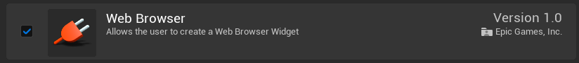


##### Widgets

- Added "SizeRule" attribute for the SSplitter widget. Optional values are "FractionOfParent" and "SizeToContent",


- And more attributes for SColorBlock and SColorPicker 

##### ChameleonData

- GetVisibility

Get the current visibility status of the widget.

- Set/GetColor

They are used for getting and setting the color of the widget.

More APIs for SWebBrowser widget though ChameleonData.

- LoadURL
- GetURL
- LoadPageFromString
- ReloadPage
- GetTitleTextOfPage
- IsPageLoaded
- IsPageLoading
- CanGoBack
- GoBack
- CanGoForward
- GoForward
- BindUobjectToBrowser
- UnbindUobjectToBrowser


##### ChameleonTool

- The tool's wind can be set with "IsModalWindow" or "HasMinimizeMaximizeButton" to hide the maximize button.

If IsModalWindow is set to True, Tab is still a nomad type and we can still dock to other Windows.


Known issue: the maximize button reappears after the window is floated from the docked window.

#### Menu

- Add "HasSection" attribute, which defaults to True, used to hide the Section text above the menu item when creating a menu with ToolMenus Anchor.

##### Add a configurable menu for PhysicsAssetEditor and ControlRigEditor

As the Material Editor, we can add custom menus for Physics Asset Editor and Control Rig Editor now.

```JSON
    "OnPhysicsAssetEditorMenu": {
        "name": "Python Menu On Physics Asset Editor",
        "items":
        [
            {
                "name": "TA Python Physics Asset Example",
                "items": [
                    {
                        "name": "Print Physics Asset",
                       "command": "print(%f)"
                    }
                ]
           }
        ]
     }
```

##### Add menu in ToolMenus Anchor

We can add a TAPython menu where the UE ToolMenus can.

```JSON
    "ControlRigEditor.RigHierarchy.ContextMenu": {
        "name": "Python Menu On Control Rig Editor",
        "items": [
            {
                "name": "Rigging Tools",
                "command": "print('Rigging Tools')",
                "icon": {
                    "style": "ChameleonStyle",
                    "name": "Resources.Chameleon_32x_png"
                }
            }
        ]
    }
```

And we can add a context menu for object's component in Detail views.

```
    Kismet.SubobjectEditorContextMenu: {
        ...
    }
```

###### Console Command

```
TAPython.RefreshToolMenus 
```

"TAPython.RefreshToolMenus" can be used to refresh the "ToolMenus" menus, other menus will be auto-refreshed and not need this command


#### Editor Lib

##### PythonBPLib

- GetModifierKeyState

GetModifierKeyState Get the modifier key states(Ctrl, Shift, Alt, etc.), so we used it to display an optional dialog or menu.

- SnapshotDetails

We can tank a snapshot of the entire Details window via 'snapshot_details'. The file will be saved to <Your_project>\Saved\Screenshots\WindowsEditor\ObjectDetailProperties. Note we need to make sure the focus is on the Details window.


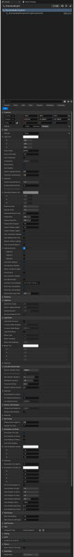

##### PythonTestLib

- CancelDelayCallById 

Cancel the specified DelayCall by ID.

##### Add PhysicsAssetLib

We got a new editor library: PhysicsAssetLib, as its name, it's for PhysicsAsset Editing.

|Function Name |Description | |
|:--- |:---- | :----|
|get_selected_bodies_indexes|Get the indexes of the selected bodies in Physics Asset Editor| |
|rotate_selected_body|Set the rotation of the selected body in Physics Asset Editor| |
|rotate_selected_constraint|Set the rotation of the selected constraint in Physics Asset Editor| |
|get_body_center|Get the center value of the specified body| |
|set_body_center|Set the center value of the specified body| |
|get_body_rotation|Get the rotation value of the first body| |
|get_bodies_rotations|Get the rotation value of the first body| |
|set_body_rotation|Set the rotation value of the specified body| |
|get_body_radius|Get the Radius value of the body| |
|set_body_radius|Set the Radius value of the body| |
|get_body_length|Get the rotation value of the first body| |
|set_body_length|Get the rotation value of the first body| |
|get_body_size|Get the Size value of the box body| |
|set_body_size|Set the Size value of the box body| |
|scale_body|Scale the specified body| |
|get_edited_physics_assets|Get all PhysicsAsset currently being tracked with open editors| |
|get_physics_asset_from_top_window|Get the PhysicsAsset from the top opened editor window.| |
|get_selected_item_names|Get all the selected items name in PhysicsAsset editor window.| |
|select_body_by_name|Select the Body by name in PhysicsAsset editor window.| |
|select_body_by_names|Select the Bodies by name in PhysicsAsset editor window.| |
|select_shape_by_name|Select the Shape by name in PhysicsAsset editor window.| |
|select_shape_by_names|Select the Shapes by name in PhysicsAsset editor window.| |
|select_constraint_by_name|Select the constraint by name in PhysicsAsset editor window.| |
|select_constraint_by_names|Select the constraints by name in PhysicsAsset editor window.| |
|add_constraints|Add constraint to specified bodies| |
|get_skeleton_hierarchy|Get the bones hierarchy| |
|get_bodies_hierarchy|Get all the bodies names and their parent bone's index| |
|get_constraints_names|Get all the constraint's display names of PhysicsAsset| |
|get_bone_indexes_of_constraint|Get the parent and child bone's indexes of the specified Constraint| |
|get_bone_index_from_body|Get the first Body under the specified bone| |
|get_bodies_from_bone|Get the Bodies under the specified bone| |
|get_constraint_instance_accessor|Get the ConstraintInstanceAccessor from PhysicsAsset| |
|reset_constraint_properties|Reset the specified Constraint's values| |
|update_profile_instance|Update the Profile according to the specified Constraint| |
|break_constraint_accessor|Get the Owner and Constraint Index from ConstraintInstanceAccessor| |

### Fixed 

- The "Margin" of STextBlock is not working.
- The "OnTextChanged" and "OnTextCommitted" callback are not working when the input text is empty. (delete the text with backspace)


### v1.0.9

#### Add PythonTestLib

A new editor lib PythonTestLib has been added to TAPython to complete the test cases of all the [extended APIs](https://www.tacolor.xyz/pages/PythonEditorLib.html).


In the test cases repo [UE_TAPython_Plugin_TestCases](https://github.com/cgerchenhp/UE_TAPython_Plugin_TestCases), more than 200 PythonLib APIs has been tested.

##### Get logs from python

Now we can get the contents of the Output Log, which we can use to validate the operation result from the editor.

Note that Logs are the same content as Output Log in the editor, but they are separate. Clearing Log in Output Log will not affect what PythonTestLib.get_log() returns, and vice visa

- [get_logs](https://www.tacolor.xyz/pages/PythonEditorLib/PythonTestLib.html#get_logs)
- [clear_log_buffer](https://www.tacolor.xyz/pages/PythonEditorLib/PythonTestLib.html#clear_log_buffer)

A new setting parameters LogNumberLimit in Config.ini will limit the maximum number of log buffers. The default size is 10240.

##### Call python command with delay and repetition

 In the test case, I used [delay_call](https://www.tacolor.xyz/pages/PythonEditorLib/PythonTestLib.html#delay_call), pushing the python scripting, then waiting for the editor to complete its asynchronous tasks, or waiting for the window to refresh, and so on.

- [delay_call](https://www.tacolor.xyz/pages/PythonEditorLib/PythonTestLib.html#delay_call)
- [cancel_delay_call](https://www.tacolor.xyz/pages/PythonEditorLib/PythonTestLib.html#delay_call)

#### Slates

##### OnMapChangedCmd

Add "OnMapChangedCmd" to the Chameleon tool for executing Python commands when changing maps.

Usage:

- Clean references in Chameleon tool when unload map to avoid memory leaks
- Sync the UI when changing map

For example, I fixed the crash when using ObjectDetailViewer tool and then loading another level, as the queried object will referenced by ObjectDetailViewer. :-(

``` json
    "OnMapChangedCmd": "chemeleon_objectDetailViewer.on_map_changed(%map_change_type)",
```

``` python
    def on_map_changed(self, map_change_type_str):
        # remove the reference, avoid memory leaking when load another map.
        if map_change_type_str == "TearDownWorld":
            self.reset(bResetParameter=False)
        else:
            pass # skip: LoadMap, SaveMap, NewMap
```

###### parameters

- %world: Get the world of map operation

- %map_change_type: Get the operation type of changing map, "LoadMap", "SaveMap", "NewMap" or "TearDownWorld"

##### SDetailViewer

We can use SDetailViewer for showing the object properties.

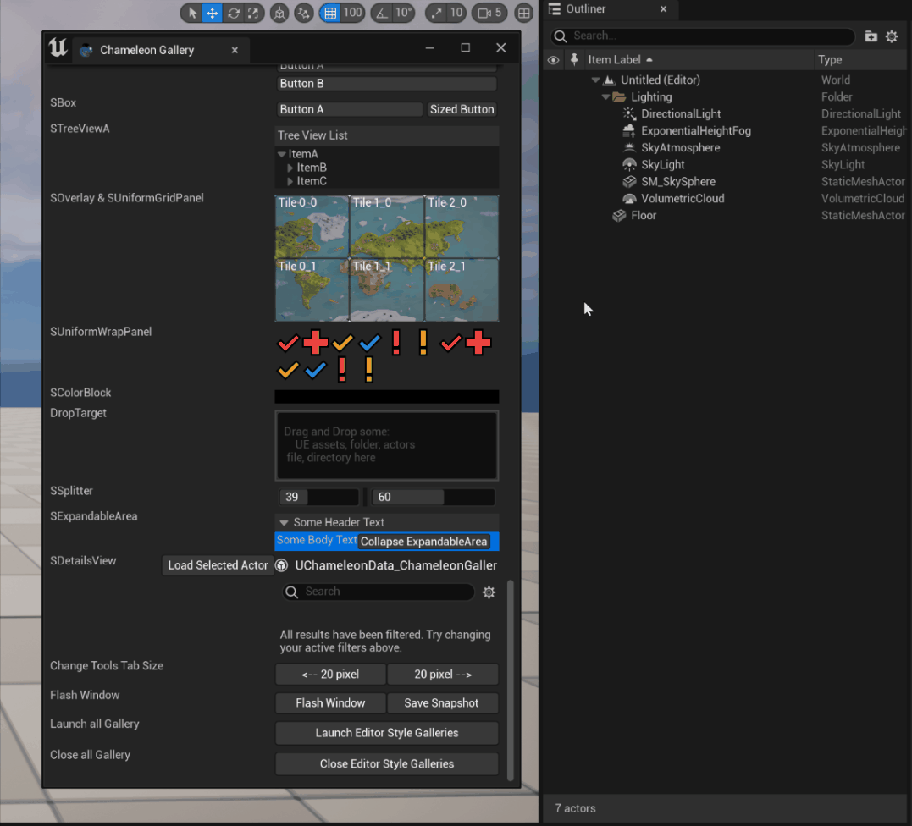

- [set_object](https://www.tacolor.xyz/pages/ChameleonDataAPI.html#set_object) to SDetailsView

##### SMultiLineEditableTextBox

- Add "AlwaysShowScrollbars" bool field in SMultiLineEditableTextBox

- Add [ScrollTo](https://www.tacolor.xyz/pages/ChameleonDataAPI.html#scroll_to) function, for scrolling the scroll bar to the specified location

##### SetColorAndOpacity

Add [SetColorAndOpacity](https://www.tacolor.xyz/pages/ChameleonDataAPI.html#set_color_and_opacity) support for SScrollBox/SImage/STextBlock/SEditableText

### PythonBPLib

- [ClearFolderColor](https://www.tacolor.xyz/pages/PythonEditorLib/PythonBPLib.html#clean_folder_color)
- [GetTAPythonVersion](https://www.tacolor.xyz/pages/PythonEditorLib/PythonBPLib.html#get_tapython_version)
- [GetLevelViewportCameraSpeed](https://www.tacolor.xyz/pages/PythonEditorLib/PythonBPLib.html#get_level_viewport_camera_speed)
- [SetLevelViewportCameraSpeed](https://www.tacolor.xyz/pages/PythonEditorLib/PythonBPLib.html#set_level_viewport_camera_speed)

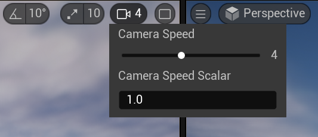

#### Fix

- remove incorrect waring logs when OnContextMenuOpening in SEditableTextBox was set.
- Fix PythonBPLib.SetFolderColor not immediate apply the color with existing directories
- Add more logs for PythonBPLib.SaveThumbnail.
- Remove redundant /All/Game", "/All/EngineData/" in the return value from PythonBPLib.GetSelectedFolder
- Fix PythonBPLib.SetSelectedFolder not work.
- Fix crash when param "comp" is null when calling PythonBpLib.set_anim_blueprint
- Fix PythonDataTableLib.SetPropertyByStringAt not work when "quote" in input values.
- Fix PythonBPLib.FixupRedirectorsInFolder not work when input value is a string.
- Fix create_landscape_proxy not work when SectionSize = 1
- Add Optional parameters QuadsSpaceOffsetX/Y for create_landscape_proxy_with_guid
- Fix crash when input value "asset_input_data" is null when calling PythonMeshLib.get_imported_original_mat_names.
- Fix crash when input value "socket" is null when calling PythonMeshLib.set_static_mesh_socket_name.
- Fix typo PythonMeshLib.get_selection_cast_shadow
- Add Deprecated warning in some PythonLib APIs to warn that some functions can use ue engine native functions instead.
- Add return value for PythonMeshLib.convert_mesh_to_static_mesh

### v1.0.8

#### Support MacOS

TAPython released its first version of MacOS Monterey (v1.0.8 for UE 5.0.3), although there are far fewer Unreal developers on the MAC than PC.  If you have any problems, please let me know.

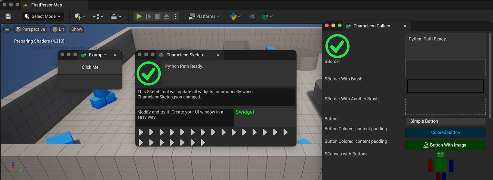

#### Context Menu for Chameleon Tools (UE5 only)

##### Global Context Menu

Now, we can add the global context menu of the Chameleon Tool by adding "OnTabContextMenu" in the MenuConfig.json.

For example, the following example adds a menu item named "Reload This Tool" to all Chameleon Tools. The tool will re-launch when the user clicks the menu. If we use [this method](https://www.tacolor.xyz/TipsOfDay/Reload_python_when_launch_Chameleon_Tool.html) to reload the python module when we open the tool, we can quickly reload both the interface and python logic, which is very convenient when developing the tools.

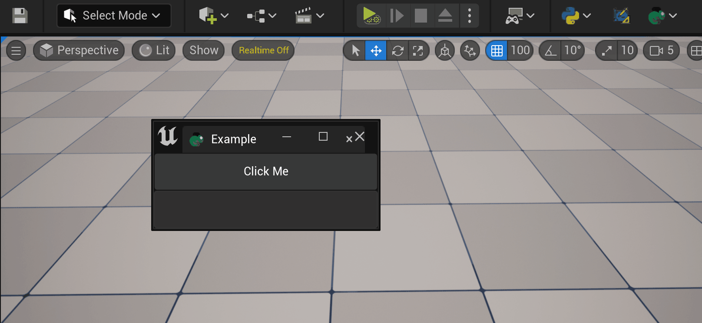

MenuConfig.json:

```JSON
"OnTabContextMenu":{
    "name": "TA Python Tab",
    "items": [
        {
            "name": "Reload This tool",
            "command": "unreal.ChameleonData.request_close(%tool_path); unreal.ChameleonData.launch_chameleon_tool(%tool_path)"
        }
    ]
}
```

##### Individual Context for each Chameleon Tool

Each Chameleon Tool can also add its own context menu. The way of adding menu is similar to the [Global Context Menu](#global-context-menu): add the "OnTabContextMenu" subitem in the Json file of tool's json file, and add the menu content to it.

For example, add a custom context menu for MinimalExample

```JSON
{
    "TabLabel": "Example",
    "InitTabSize": [200, 123],
    "InitTabPosition": [180, 200],
    "InitPyCmd": "import Example; chameleon_example = Example.MinimalExample.MinimalExample(%JsonPath)",
    "Root":
    {
        ...
    },
    "OnTabContextMenu":{
        "items": [
            {
                "name": "Reset Click Count",
                "command": "chameleon_example.reset_click_count()"
            }
        ]
    }
}
```

Or a menu item that switches the tool to "Development Mode" for your tool.

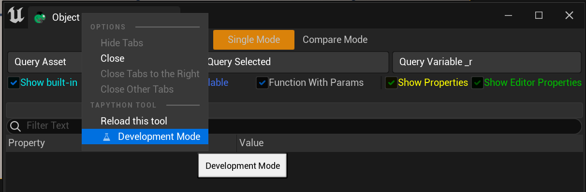

Tips:

- These new context menu only support UE5, now
- OnTabContextMenu also support sub menu items

##### New Content Menu for **Material Editor**


One of the most **important** features in this release is the addition of support for the Material Editor.

Now we can add custom menu items directly to the material editor and pass the material instance that we are currently editing to the python script so that we can "play with" the material nodes directly in python.

The *%asset_paths* in the following example will be replaced by the TAPython with an array of paths to the material currently being edited, which usually has only one element.


With the [APIs](#more-pythonmateriallib-apis) added to PythonMaterialLib in this release, we can fully script the material expression nodes via Python.

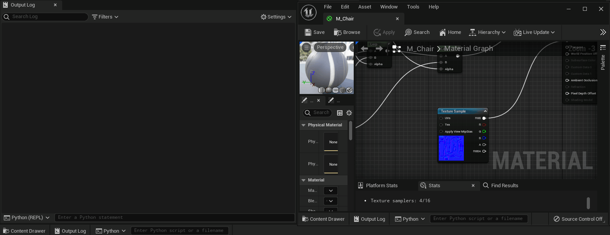

MenuConfig.json:

```Json
    "OnMaterialEditorMenu": {
        "name": "Python Menu On Material Editor",
        "items":
        [
            {
                "name": "TA Python Material Example",
                "items": [
                    {
                        "name": "Print Editing Material / MF",
                        "command": "print(%asset_paths)"
                    },
                    {
                        "name": "Log Editing Nodes",
                        "command": "editing_asset = unreal.load_asset(%asset_paths[0]); unreal.PythonMaterialLib.log_editing_nodes(editing_asset)"
                    },
                    {
                        "name": "Selected Nodes --> global variable _r",
                        "command": "_r = unreal.PythonMaterialLib.get_selected_nodes_in_material_editor(unreal.load_asset(%asset_paths[0]))"
                    }
                ]
            }
        ]
    },
```

#### Slates

##### SScrollBox

- [get_scroll_box_offsets](https://www.tacolor.xyz/pages/ChameleonDataAPI.html#get_scroll_box_offsets)
- [set_scroll_box_offsets](https://www.tacolor.xyz/pages/ChameleonDataAPI.html#set_scroll_box_offsets)

Now we can calculate the size of all content in the whole ScrollBox from the Offset, ScrollOffsetOfEnd，ViewFraction，ViewOffsetFraction, etc. Then use [SnapshotChameleonWindow](https://www.tacolor.xyz/pages/ChameleonDataAPI.html#snapshot_chameleon_window) to capture the contents of the entire tool window, including the parts of ScrollBox that are **not shown**.


##### SButton

Add *%widgetPath* keyword in JSON

It will pass the widget path of the current clicked button to python code, so we can figure out which SButton was clicked, when we import the External JONS file multi-times.


#### More Control with Chameleon Tool's Window

- [Flash the Chameleon Tool][2]

  When we need to remind the user to a specified tool, we can use the flash_chameleon_window.

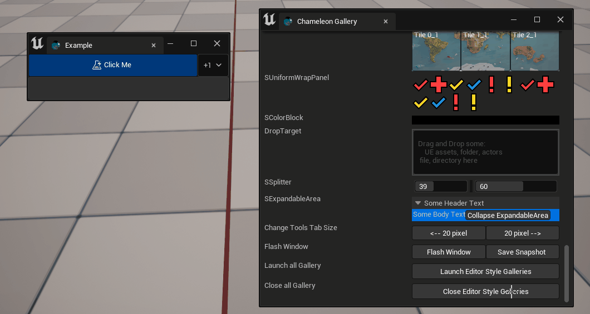

- [get/set Chameleon Tools size](https://www.tacolor.xyz/pages/ChameleonDataAPI.html#get_chameleon_window_size)

- [get/set Chameleon Tools position](https://www.tacolor.xyz/pages/ChameleonDataAPI.html#get_chameleon_window_position)

- [SnapShot The Whole Chameleon Window](https://www.tacolor.xyz/pages/ChameleonDataAPI.html#flash_chameleon_window)

We can capture the contents of the entire chameleon tool window, including the parts of ScrollBox that are not shown.

For example, the ChameleonGallery tool that comes with the plugin is over 3,000 pixels height and wrapped in ScrollBox, which we can also save as an image at once.

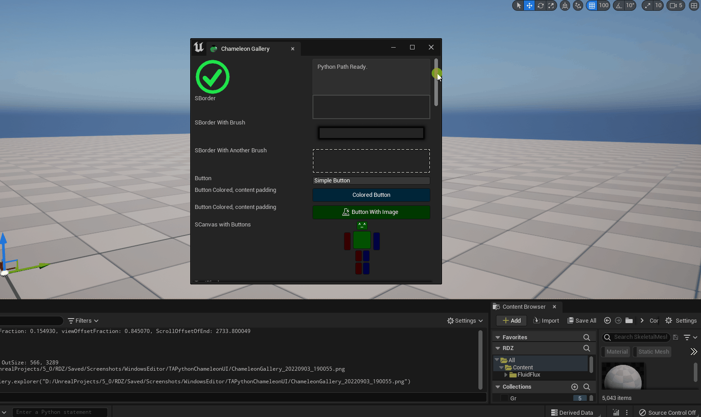

The following code will calculate the size of the contents in the entire tool window, then take the snapshot.

```Python
    def get_full_size_of_this_chameleon(self):
        current_size = unreal.ChameleonData.get_chameleon_window_size(self.jsonPath)
        scrollbox_offsets = self.data.get_scroll_box_offsets(self.ui_scrollbox)
        height_full = scrollbox_offsets["ScrollOffsetOfEnd"] / (1.0 - scrollbox_offsets["viewFraction"])
        height_full += 48   # add title bar
        return current_size.x, round(height_full)

    def on_button_Snapshot_click(self):
        full_size = self.get_full_size_of_this_chameleon()
        saved_file_path = unreal.ChameleonData.snapshot_chameleon_window(self.jsonPath, unreal.Vector2D(*full_size))
        
        if saved_file_path:
            unreal.PythonBPLib.notification(f"UI Snapshot Saved:", hyperlink_text = saved_file_path
                                            , on_hyperlink_click_command = f'chameleon_gallery.explorer("{saved_file_path}")')
        else:
            unreal.PythonBPLib.notification(f"Save UI snapshot failed.", info_level = 1)
```

#### More [PythonMaterialLib APIs](https://www.tacolor.xyz/pages/PythonEditorLib/PythonMaterialLib.html) 

Now we can iterate, create, and modify **Material Expression** nodes of Material and Material Function with Python. Including the nodes that cannot be created or modified in the MaterialEditingLibrary. For example, connect properties to World Position Offset, add Get/SetMaterialAttribute nodes, etc.

For more details and examples of material expressions can be found here: [How to manipulate Material Expressions Node in Material with Python in Unreal Engine](https://www.tacolor.xyz/Howto/Manipulate_Material_Expression_Nodes_Of_Material_With_Python_In_UE.html)


|PythonMaterialLib |Description | Is New added|
|:--- |:---- | :----|
|<a href="https://www.tacolor.xyz/pages/PythonEditorLib/PythonMaterialLib.html#get_static_switch_parameter_values">get_static_switch_parameter_values</a>|Get the Static Switch Infos of material instance| |
|<a href="https://www.tacolor.xyz/pages/PythonEditorLib/PythonMaterialLib.html#set_static_switch_parameter_value">set_static_switch_parameter_value</a>|Set the Static Switch Infos of material instance| |
|<a href="https://www.tacolor.xyz/pages/PythonEditorLib/PythonMaterialLib.html#set_static_switch_parameters_values">set_static_switch_parameters_values</a>|Batch set the Static Switch's status of material instance.| |
|<a href="https://www.tacolor.xyz/pages/PythonEditorLib/PythonMaterialLib.html#get_mf_static_switch_parameter">get_mf_static_switch_parameter</a>|Get the Static Switch Infos of material function.| |
|<a href="https://www.tacolor.xyz/pages/PythonEditorLib/PythonMaterialLib.html#get_static_parameters_summary">get_static_parameters_summary</a>|Get the numbers of each StaticSwitchParameter of material instance.| |
|<a href="https://www.tacolor.xyz/pages/PythonEditorLib/PythonMaterialLib.html#log_mat">log_mat</a>|Log out all the connections in the material| Yes |
|<a href="https://www.tacolor.xyz/pages/PythonEditorLib/PythonMaterialLib.html#get_material_expressions">get_material_expressions</a>|Log out all the Material Expressions in the material| Yes |
|<a href="https://www.tacolor.xyz/pages/PythonEditorLib/PythonMaterialLib.html#get_all_referenced_expressions">get_all_referenced_expressions</a>|Get Material Expressions in the material with specified feature level| Yes |
|<a href="https://www.tacolor.xyz/pages/PythonEditorLib/PythonMaterialLib.html#get_material_connections">get_material_connections</a>|Get all the connections in the material| Yes |
|<a href="https://www.tacolor.xyz/pages/PythonEditorLib/PythonMaterialLib.html#get_material_function_connections">get_material_function_connections</a>|Get all the connections in the material function| Yes |
|<a href="https://www.tacolor.xyz/pages/PythonEditorLib/PythonMaterialLib.html#get_material_expression_input_names">get_material_expression_input_names</a>|Get the input pin's names of the material expression| Yes |
|<a href="https://www.tacolor.xyz/pages/PythonEditorLib/PythonMaterialLib.html#get_material_expression_output_names">get_material_expression_output_names</a>|Get the output pin's names of the material expression| Yes |
|<a href="https://www.tacolor.xyz/pages/PythonEditorLib/PythonMaterialLib.html#get_material_expression_captions">get_material_expression_captions</a>|The captions of the material expression| Yes |
|<a href="https://www.tacolor.xyz/pages/PythonEditorLib/PythonMaterialLib.html#set_shading_model">set_shading_model</a>|Set the shading model of the material, for the hidden shading model| Yes |
|<a href="https://www.tacolor.xyz/pages/PythonEditorLib/PythonMaterialLib.html#get_material_expression_id">get_material_expression_id</a>|Get the ParameterExpressionId of the material expression.| Yes |
|<a href="https://www.tacolor.xyz/pages/PythonEditorLib/PythonMaterialLib.html#log_mf">log_mf</a>|Log out all the connections in the material function| Yes |
|<a href="https://www.tacolor.xyz/pages/PythonEditorLib/PythonMaterialLib.html#get_material_function_expressions">get_material_function_expressions</a>|Get all the expressions in the Material Function| Yes |
|<a href="https://www.tacolor.xyz/pages/PythonEditorLib/PythonMaterialLib.html#get_material_function_output_expressions">get_material_function_output_expressions</a>|Get all the output expressions in the Material Function| Yes |
|<a href="https://www.tacolor.xyz/pages/PythonEditorLib/PythonMaterialLib.html#get_selected_material_nodes">get_selected_material_nodes</a>|Get the selected nodes in material editor.| Yes |
|<a href="https://www.tacolor.xyz/pages/PythonEditorLib/PythonMaterialLib.html#log_material_expression">log_material_expression</a>|Log Detail information of the MaterialExpression, include inputs, outputs etc.| Yes |
|<a href="https://www.tacolor.xyz/pages/PythonEditorLib/PythonMaterialLib.html#log_editing_nodes">log_editing_nodes</a>|Log Detail information of the Material or Material Function| Yes |
|<a href="https://www.tacolor.xyz/pages/PythonEditorLib/PythonMaterialLib.html#get_selected_nodes_in_material_editor">get_selected_nodes_in_material_editor</a>|Get the selected nodes in material editor.| Yes |
|<a href="https://www.tacolor.xyz/pages/PythonEditorLib/PythonMaterialLib.html#get_hlsl_code">get_hlsl_code</a>|Get the HLSL code of the Material| Yes |
|<a href="https://www.tacolor.xyz/pages/PythonEditorLib/PythonMaterialLib.html#get_shader_map_info">get_shader_map_info</a>|Get the ShaderMaps infos in string format.| Yes |
|<a href="https://www.tacolor.xyz/pages/PythonEditorLib/PythonMaterialLib.html#get_material_content">get_material_content</a>|Get the material's content in JSON Format| Yes |
|<a href="https://www.tacolor.xyz/pages/PythonEditorLib/PythonMaterialLib.html#get_material_function_content">get_material_function_content</a>|Get the material function's content in JSON Format| Yes |
|<a href="https://www.tacolor.xyz/pages/PythonEditorLib/PythonMaterialLib.html#connect_material_expressions">connect_material_expressions</a>|Create connection between two material expressions| Yes |
|<a href="https://www.tacolor.xyz/pages/PythonEditorLib/PythonMaterialLib.html#disconnect_expression">disconnect_expression</a>|Disconnection the material expression's input| Yes |
|<a href="https://www.tacolor.xyz/pages/PythonEditorLib/PythonMaterialLib.html#connect_material_property">connect_material_property</a>|Connect a material expression output to one of the material property inputs (e.g. diffuse color,  world position offset etc)| Yes |
|<a href="https://www.tacolor.xyz/pages/PythonEditorLib/PythonMaterialLib.html#disconnect_material_property">disconnect_material_property</a>|Disconnect the material property input| Yes |
|<a href="https://www.tacolor.xyz/pages/PythonEditorLib/PythonMaterialLib.html#get_material_proper_str_from_guid">get_material_proper_str_from_guid</a>|Get EMaterialProperty in string format from a guid| Yes |
|<a href="https://www.tacolor.xyz/pages/PythonEditorLib/PythonMaterialLib.html#gen_guid_from_material_property_str">gen_guid_from_material_property_str</a>|Generate a Guid from EMaterialProperty| Yes |
|<a href="https://www.tacolor.xyz/pages/PythonEditorLib/PythonMaterialLib.html#add_input_at_expression_set_material_attributes">add_input_at_expression_set_material_attributes</a>|Add an Attribute Get Type pin for material expression "GetMaterialAttributes"| Yes |
|<a href="https://www.tacolor.xyz/pages/PythonEditorLib/PythonMaterialLib.html#add_output_at_expression_get_material_attributes">add_output_at_expression_get_material_attributes</a>|Add an Attribute Get Type pin for material expression "GetMaterialAttributes"| Yes |

---

### 1.0.7

#### SImage

Add Mouse Event for SImage

- OnMouseMove
- OnMouseEnter
- OnMouseLeave events

With the three mouse events, our python code can use them to perform more complex operations based on the user's mouse input in SImage.

The %uv, %mouse_flags in the following example will be automatically replaced with the UV coordinates of the mouse in SImage and the pressed state of the left, middle and right mouse button

```JSON
{
    "SImage": {
        "DesiredSizeOverride": [200, 200],
        "Aka": "ImageCanvas",
        "OnTick": "your_tool.on_tick()",
        "OnMouseLeave": "your_tool.on_mouse_leave(%mouse_flags)",
        "OnMouseMove": "your_tool.on_mouse_move(%uv, %mouse_flags)"
    }
}
```

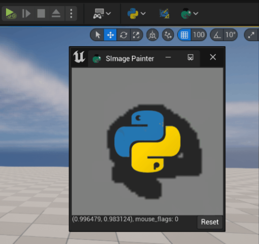

The user's operation in SImage is taken as Stable Fluid function's input, then using result drive the volume cloud with [set_render_target_data][3] function of PythonTextureLibs.

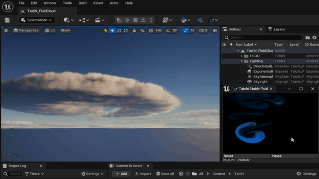

#### Add More Editor APIs

[PythonStructLib](https://www.tacolor.xyz/pages/PythonEditorLib/PythonStructLib.html)

- [GetVariableDefaultValue](https://www.tacolor.xyz/pages/PythonEditorLib/PythonStructLib.html#get_variable_default_value)

[PythonBPLib](https://www.tacolor.xyz/pages/PythonEditorLib/PythonBPLib.html)

- [BreakSoftObject](https://www.tacolor.xyz/pages/PythonEditorLib/PythonBPLib.html#break_soft_object)

- [Notification](https://www.tacolor.xyz/pages/PythonEditorLib/PythonBPLib.html#notification)

    Two new optional parameters in notifications were added, for adding a specify hyperlinks and the custom python function that executes when click. So we can quickly jump to a specific location or open a hyperlink.

#### [PythonTextureLib](https://www.tacolor.xyz/pages/PythonEditorLib/PythonTextureLib.html)

- [CreateTexture2DFromRaw](https://www.tacolor.xyz/pages/PythonEditorLib/PythonTextureLib.html#create_texture2d_frow_raw)
- [SetRenderTargetData](https://www.tacolor.xyz/pages/PythonEditorLib/PythonTextureLib.html#set_render_target_data)
- [GetRenderTargetRawData](https://www.tacolor.xyz/pages/PythonEditorLib/PythonTextureLib.html#get_render_target_raw_data)

More information and example about modify RenderTexture2D and SImage can be found [here](https://www.tacolor.xyz/Modify_SImage_Content_And_Set_Pixels_to_RenderTarget_in_Unreal_Engine.html).

#### Fix

- PythonStructLib.get_guid_from_friendly_name not return the correct guid.

[1]: https://www.tacolor.xyz/TipsOfDay/Reload_python_when_launch_Chameleon_Tool.html "Reload_python_when_launch_Chameleon_Tool"
[2]: https://www.tacolor.xyz/pages/ChameleonDataAPI.html#flash_chameleon_window
[3]: https://www.tacolor.xyz/pages/PythonEditorLib/PythonTextureLib.html#set_render_target_data
[4]: https://www.tacolor.xyz/pages/ChameleonDataAPI.html#get_chameleon_window_size


### In v1.0.6
Added:
- Support Unreal Engine 5.0.3
- Support Unreal Engine 4.27.2
- Support Unreal Engine 4.26.2
- Add an optional parameter: "friendly name" to PythonStructLib.add_variable and PythonStructLib.add_directory_variable
- Better warning message for PythonDataTableLib.set_property_by_string when "row_name" or "column_name" not exists in datatable
  
Fixed:
- The Chameleon tab's reference not released when the project closes.


### In v1.0.5
[PythonEnumLib](https://www.tacolor.xyz/pages/PythonEditorLib/PythonEnumLib.html) and [PythonStructLib](https://www.tacolor.xyz/pages/PythonEditorLib/PythonStructLib.html) has been added to [Python Editor Libs](https://www.tacolor.xyz/pages/PythonEditorLib.html), [PythonDataTableLib](https://www.tacolor.xyz/pages/PythonEditorLib/PythonDataTableLib.html) also adds more python/blueprint callable functions.

|PythonEnumLib |PythonStructLib |PythonDataTableLib |
|:--- |:--- |:--- |
|<a href="https://www.tacolor.xyz/pages/PythonEditorLib/PythonEnumLib.html#get_display_name_map">get_display_name_map</a>|<a href="https://www.tacolor.xyz/pages/PythonEditorLib/PythonStructLib.html#log_var_desc">log_var_desc</a>|<a href="https://www.tacolor.xyz/pages/PythonEditorLib/PythonDataTableLib.html#get_data_table_struct_path">get_data_table_struct_path</a>|
|<a href="https://www.tacolor.xyz/pages/PythonEditorLib/PythonEnumLib.html#set_enum_items">set_enum_items</a>|<a href="https://www.tacolor.xyz/pages/PythonEditorLib/PythonStructLib.html#log_var_desc_by_friendly_name">log_var_desc_by_friendly_name</a>|<a href="https://www.tacolor.xyz/pages/PythonEditorLib/PythonDataTableLib.html#get_data_table_struct">get_data_table_struct</a>|
|<a href="https://www.tacolor.xyz/pages/PythonEditorLib/PythonEnumLib.html#get_enum_len">get_enum_len</a>|<a href="https://www.tacolor.xyz/pages/PythonEditorLib/PythonStructLib.html#get_variable_description">get_variable_description</a>|<a href="https://www.tacolor.xyz/pages/PythonEditorLib/PythonDataTableLib.html#get_table_as_json">get_table_as_json</a>|
|<a href="https://www.tacolor.xyz/pages/PythonEditorLib/PythonEnumLib.html#get_display_name_by_index">get_display_name_by_index</a>|<a href="https://www.tacolor.xyz/pages/PythonEditorLib/PythonStructLib.html#get_guid_from_friendly_name">get_guid_from_friendly_name</a>|<a href="https://www.tacolor.xyz/pages/PythonEditorLib/PythonDataTableLib.html#get_row_names">get_row_names</a>|
|<a href="https://www.tacolor.xyz/pages/PythonEditorLib/PythonEnumLib.html#set_display_name">set_display_name</a>|<a href="https://www.tacolor.xyz/pages/PythonEditorLib/PythonStructLib.html#get_guid_from_property_name">get_guid_from_property_name</a>|<a href="https://www.tacolor.xyz/pages/PythonEditorLib/PythonDataTableLib.html#get_column_names">get_column_names</a>|
|<a href="https://www.tacolor.xyz/pages/PythonEditorLib/PythonEnumLib.html#get_description_by_index">get_description_by_index</a>|<a href="https://www.tacolor.xyz/pages/PythonEditorLib/PythonStructLib.html#get_variable_names">get_variable_names</a>|<a href="https://www.tacolor.xyz/pages/PythonEditorLib/PythonDataTableLib.html#get_shape">get_shape</a>|
|<a href="https://www.tacolor.xyz/pages/PythonEditorLib/PythonEnumLib.html#set_description_by_index">set_description_by_index</a>|<a href="https://www.tacolor.xyz/pages/PythonEditorLib/PythonStructLib.html#get_friendly_names">get_friendly_names</a>|<a href="https://www.tacolor.xyz/pages/PythonEditorLib/PythonDataTableLib.html#remove_row">remove_row</a>|
|<a href="https://www.tacolor.xyz/pages/PythonEditorLib/PythonEnumLib.html#get_name_by_index">get_name_by_index</a>|<a href="https://www.tacolor.xyz/pages/PythonEditorLib/PythonStructLib.html#is_unique_friendly_name">is_unique_friendly_name</a>|<a href="https://www.tacolor.xyz/pages/PythonEditorLib/PythonDataTableLib.html#add_row">add_row</a>|
|<a href="https://www.tacolor.xyz/pages/PythonEditorLib/PythonEnumLib.html#move_enum_item">move_enum_item</a>|<a href="https://www.tacolor.xyz/pages/PythonEditorLib/PythonStructLib.html#add_variable">add_variable</a>|<a href="https://www.tacolor.xyz/pages/PythonEditorLib/PythonDataTableLib.html#duplicate_row">duplicate_row</a>|
|<a href="https://www.tacolor.xyz/pages/PythonEditorLib/PythonEnumLib.html#is_bitflags_type">is_bitflags_type</a>|<a href="https://www.tacolor.xyz/pages/PythonEditorLib/PythonStructLib.html#add_directory_variable">add_directory_variable</a>|<a href="https://www.tacolor.xyz/pages/PythonEditorLib/PythonDataTableLib.html#rename_row">rename_row</a>|
|<a href="https://www.tacolor.xyz/pages/PythonEditorLib/PythonEnumLib.html#set_bitflags_type">set_bitflags_type</a>|<a href="https://www.tacolor.xyz/pages/PythonEditorLib/PythonStructLib.html#remove_variable_by_name">remove_variable_by_name</a>|<a href="https://www.tacolor.xyz/pages/PythonEditorLib/PythonDataTableLib.html#reset_row">reset_row</a>|
|<a href="https://www.tacolor.xyz/pages/PythonEditorLib/PythonEnumLib.html#get_cpp_form">get_cpp_form</a>|<a href="https://www.tacolor.xyz/pages/PythonEditorLib/PythonStructLib.html#rename_variable">rename_variable</a>|<a href="https://www.tacolor.xyz/pages/PythonEditorLib/PythonDataTableLib.html#move_row">move_row</a>|
| |<a href="https://www.tacolor.xyz/pages/PythonEditorLib/PythonStructLib.html#change_variable_default_value">change_variable_default_value</a>|<a href="https://www.tacolor.xyz/pages/PythonEditorLib/PythonDataTableLib.html#get_row_name">get_row_name</a>|
| | |<a href="https://www.tacolor.xyz/pages/PythonEditorLib/PythonDataTableLib.html#get_column_name">get_column_name</a>|
| | |<a href="https://www.tacolor.xyz/pages/PythonEditorLib/PythonDataTableLib.html#get_flatten_data_table">get_flatten_data_table</a>|
| | |<a href="https://www.tacolor.xyz/pages/PythonEditorLib/PythonDataTableLib.html#get_property_as_string">get_property_as_string</a>|
| | |<a href="https://www.tacolor.xyz/pages/PythonEditorLib/PythonDataTableLib.html#get_property_as_string_at">get_property_as_string_at</a>|
| | |<a href="https://www.tacolor.xyz/pages/PythonEditorLib/PythonDataTableLib.html#set_property_by_string">set_property_by_string</a>|
| | |<a href="https://www.tacolor.xyz/pages/PythonEditorLib/PythonDataTableLib.html#set_property_by_string_at">set_property_by_string_at</a>|


 In short, we can use Python to do almost everything you did manually in the editor with **User defined ENum, User Defined Struct and DataTable**. More details and examples can be found [here](https://www.tacolor.xyz/Howto/How_To_Create_User_Defined_ENum_Struct_DataTable_with_Python_in_UE5.html).


### v1.0.4
Support more slates:
#### Now we can create widge: [SSplitter](https://www.tacolor.xyz/pages/Widgets/SSplitter.html)
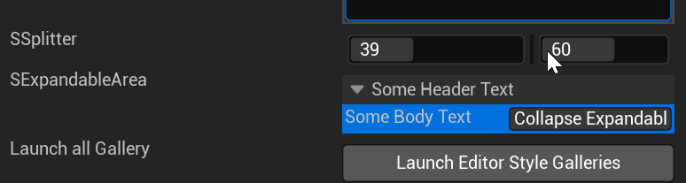

#### And [SExpandableArea](https://www.tacolor.xyz/pages/Widgets/SExpandableArea.html)
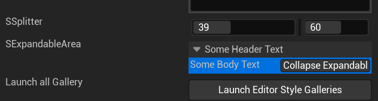

Two APIs was added in [ChameleonData](https://www.tacolor.xyz/pages/ChameleonDataAPI.html) for [SExpandableArea](https://www.tacolor.xyz/pages/Widgets/SExpandableArea.html):
  1. bool GetIsExpanded(const FName AkaName)
  2. void SetIsExpanded(const FName AkaName, bool bExpanded, bool bAnimated=false)
```
data.get_is_expanded(aka_name) -> bool
    Get the Expanded state of Specified SExpandableArea
    note: Supported widgets: SExpandableArea.
    note: added in v1.0.4

    Args:
        aka_name (Name): The aka name of the widget

    Returns:
        bool: Is Expanded or not.
```

```
	data.set_is_expanded(aka_name, expanded, animated=False) -> None
	    Set the Expanded state of Specified SExpandableArea
	    note: Supported widgets: SExpandableArea.
	    note: added in v1.0.4
	
	    Args:
	        aka_name (Name): The aka name of the widget
	        expanded (bool): Is Expanded or not.
	        animated (bool): Expanded with animation or not.
```

### Add Context menu in Outline window

Now we can add context menu in Outline window, with the "OnOutlineMenu" field in MenuConfig.ini.  


```json
    "OnOutlineMenu": {
        "name:": "Python Menu On OutlineMenu",
        "items":
        [
            {
                "name": "Print selected actors",
                "command": "print(unreal.get_editor_subsystem(unreal.EditorActorSubsystem).get_selected_level_actors())"
            }
        ]
    },
```

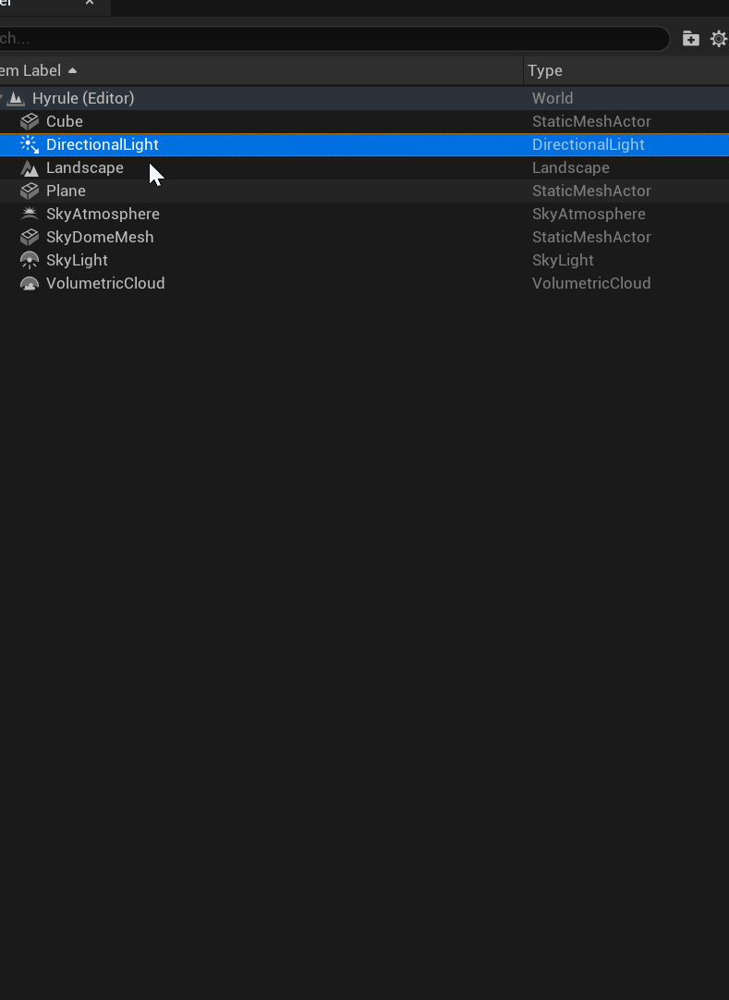

### Add configurable icons in front the menu item 

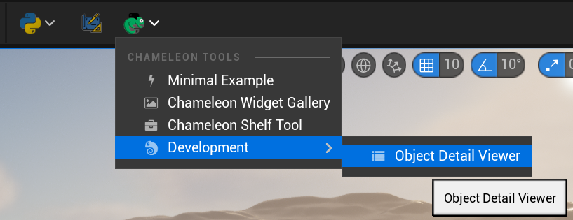

The .png and.svg files in the plugin resource directory will be added to "ChameleonStyle" automatically. Then we can use it for menu items.


- We can specify the icon of a menu item with a relative path of the icon image in the plug-in resource directory.
``` json
    {
        "name": "Chameleon Shelf Tool",
        "ChameleonTools": "../Python/ShelfTools/Shelf.json",
        "icon": {
            "ImagePathInPlugin": "Resources/briefcase_32x.png"
        }
    },
```
- Or use ImageBrush directly in the style. For instance, the image brushes in FEditorStyle, FCoreStyle
```json
    {
        "name": "Minimal Example",
        "ChameleonTools": "../Python/Example/MinimalExample.json",
        "icon": {
            "style": "ChameleonStyle",
            "name": "Flash"
        }
    }
```

### The Chameleon UI .json file can reference other json files.
 
Now the Chameleon UI json file can reference other Json files. Nested references are supported, but circular references need to be avoided


```json
    {
        "autoWidth": true,
        "SBox": {
            "WidthOverride": 480,
            "Content": {
                "ExternalJson": "ZeldaWorldMapEditor_Buttons.json"
            }
        }
    }
```


#### pros:
- Reduce the complexity and size of a single json file
- reuse part ui code 

#### cons:
- The UI json files becomes less intuitive and more obscure
- The Widget path logged in the console window is not the same as the Json crumb path shown in PyCharm. As PyCharm don't know that another json content has being "import" here.

#### recommendation:
- Put the repetitive ui code (such as 16x16 map buttons) or the ui code which generated by other script into an "external" json file.


### The number of shortcut keys has been increased to 10
  
The number of shortcuts that can be configured in ExitorSettings has now been increased to 10. It will be a configurable number in later version.

 

### Add "BorderBackgroundColor" of SBorder
 ```json
    {
        "SBorder": {
            "BorderBackgroundColor": [1, 0.5, 0, 1],
            "BorderImage":
            {
                "Style": "FEditorStyle",
                "Brush": "ErrorReporting.EmptyBox"
            }
        }
    }
```

### Add More API in PythonBPLib:

- GetViewportPixels
Now we can grab and get the content of viewport. Use it in tools widgets:

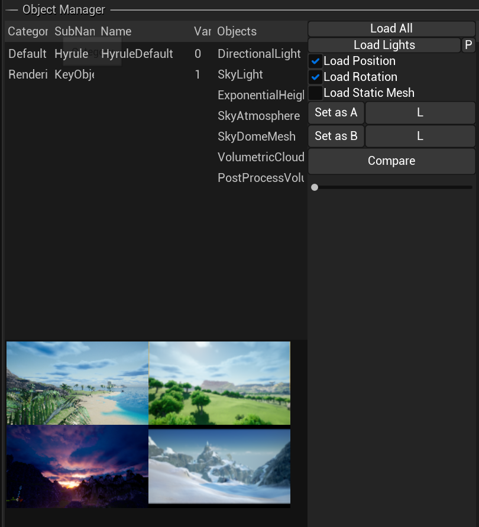

Or send it to other device, for example, I send the viewport content to my MacroKeyboard. I think this is the smallest screen which displays Unreal Engine viewport content :D


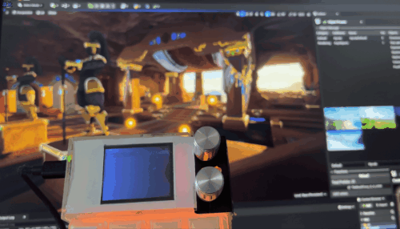

- ViewportRedraw

Force the viewport Redraw

- GetObjectFlags

We can get the EObjectFlags of a UObject.

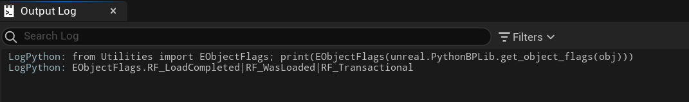
 
- GetLevelViewportCameraFov


- GetActorsFromFolder
Get the actors in Specified folder in outline

- FindActorsByLabelName

Find the actor by it's "label name" not the "actor name" 


### Config.ini
- add LogOnTickWarnings in config.ini
```ini
  LogOnTickWarnings=True
```
This option controls whether a warning is printed when the user uses the keyword OnTick.

ChameleonTools has a hidden keyword that has not been mentioned: "OnTick". The python code in it is executed during Slate updates, which are much more frequent than viewPort updates, So the py code can easily lower the editor's FPS.

"OnTick" is hidden because 99.9% of the time it is not needed and there are better ways to do it if there is a "real" need. So I don't recommend using OnTick and changing the LogOnTickWarnings setting.


### Fix:

- Fixed RequestClose failing after Chameleon dock to another window.

- Fixed unreal.PythonBp.get_all_objects crash, when some objects don't have "world"

- Fixed the incorrect display of the Breadcrumb in Python Tool: ObjectDetailViewer

- Fixed chameleonData.get_float_value failed with SSpinBox

- Fixed incorrect Padding setting in SBox

## Feature
- Use UE4 and UE5 native Python  
- Create UE Slate UI dynamically, support 39+ Slate widgets.
- Configurable main menu/toolbar/Content Brower menu.
- Slate like syntax interface description file, real-time preview UI result, without any reload.
- Bind Python command to Slate UI widget, and change the UI content with python.
- No enging source code modified, compatible with lower versions of UE4(4.21, release later) and latest UE5
- 100+ Extra Editor Command for Python and Blutility.

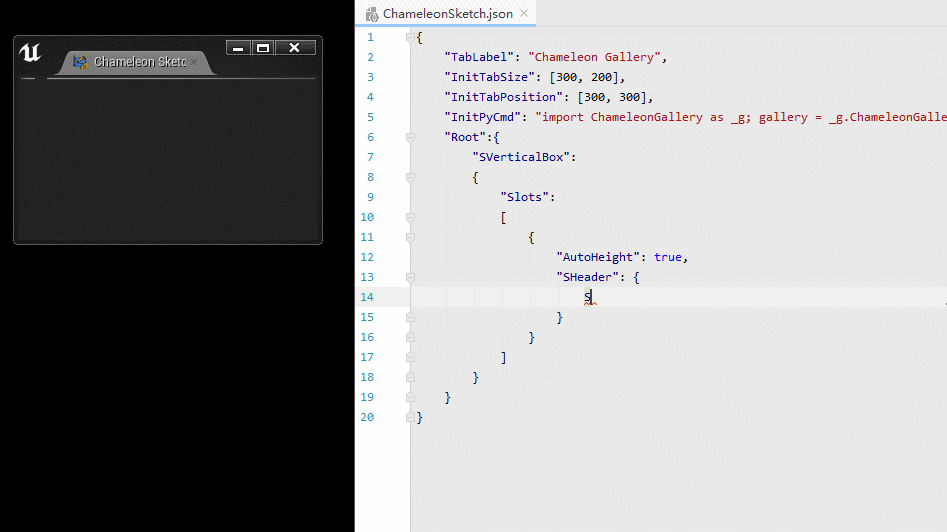

## How to Install

### Prerequisites 
This plugin use UE native Python Script Plugin. The [Scripting the Editor using Python](https://docs.unrealengine.com/en-US/Engine/Editor/ScriptingAndAutomation/Python/index.html) is also very useful.

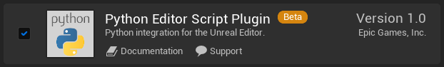

### Steps
1. Download from [TAPython release repo @github](https://github.com/cgerchenhp/UE_TAPython_Plugin_Release) and unzip the plugin to &lt;Your_UE_Project&gt;\Plugins
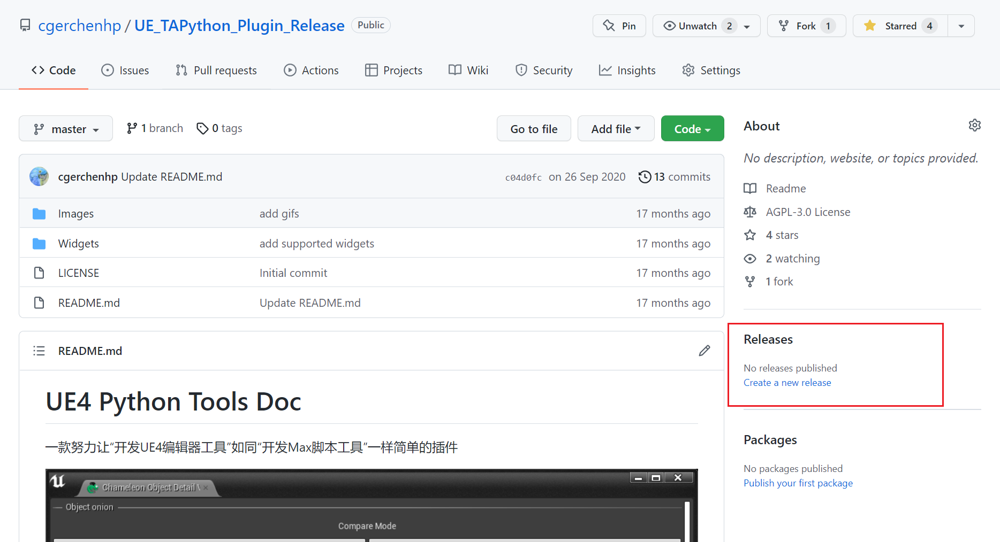
```
    Your_UE_Project
    ├── Content                         
    ├── ...
    └── Plugins                        
        └── TAPython       # <--- Put Plugin Here
            ├── Binaries                     
            ├── Config                     
            └── Content                   
            └─ ...
```
<a id="add_path_in_project_setting"></a>

2. Laungch project, open Project settings - Plugin Python - additional path, add &lt;Your_UE_Project&gt;/TA/TAPython/Python to additional path. then restart the editor.

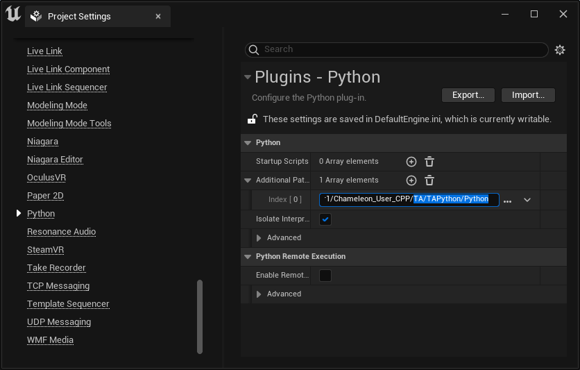

3. click the **Gallery** icon on main toolbar, you should see a green check box UI like below.

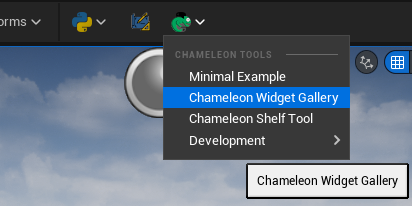

Green sign and text "Python Path Ready" will showing at the top of gallery.

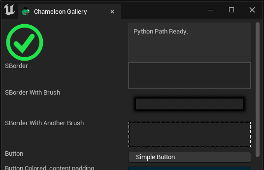

If a Red Cross is displayed, check the Project Setting above.

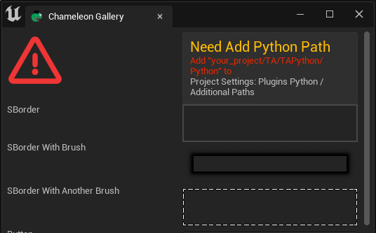


## Quick Start

The plug-in package contains several menu items and four demo tools by default. 

The latest DefaultResources is here: [DefaultResources@github](https://github.com/cgerchenhp/TAPython_DefaultResources) 


### Menu Items

- Context Menu Items in Content Browser
- Context Menu Items for selected asset
- Menu Item in Main menu
- Menu icons on Mainbar

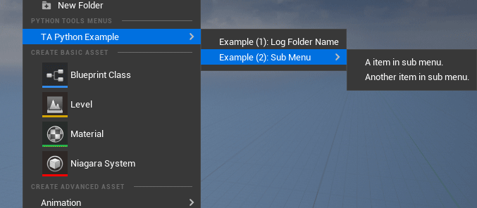


### Sketch Tool for design/tweaking UI 
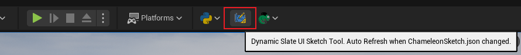


The **Sketch Tool** is a special ui design tool. When the&lt;Your_UE_Project&gt\TA\TAPython\Python\ChameleonSketch\ChameleonSketch.json file is modified, the content of the ui will be updated immediately(see below gif). This can be very useful when writing tool interfaces, and will save a lot of time when tweaking the interface layout or parameters.


The default sketch tool looks like below. Try to modify the content of ChameleonSketch.json with any text editor, and save it. Don't worry about the json keywords and syntax, it's easy to learn and has lots of examples, will be described below. 

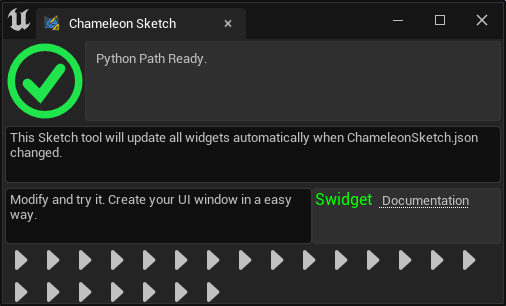 

---

### Example Tools

All the 4 Example tools, are written with python, **without** any single line of c++ code.

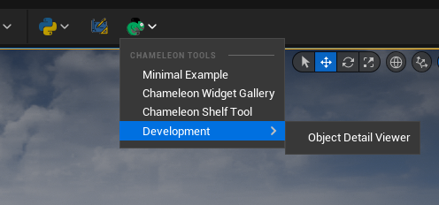

#### Tool 1: MinimalExample
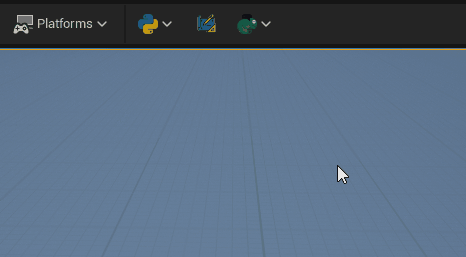


This is a tool demonstrating the creation of a standard UE Slate UI with python and a json file. The Button calls Python code, then the python code sends the results(click count) back to the UI.

The tool includes a 30-lines Json file and a 15-lines Python file. In fact, it can be shorter.

I will call this kind of tool which creates Slate interfaces in this way "Chameleon Tools"

MinimalExample.json：

```
    {
        "TabLabel": "Example",
        "InitTabSize": [200, 123],
        "InitTabPosition": [680, 150],
        "InitPyCmd": "import Example; chameleon_example = Example.MinimalExample.MinimalExample(%JsonPath)",
        "Root":
        {
            "SVerticalBox":
            {
                "Slots": [
                    {
                        "SButton": {
                            "Text": "Click Me",
                            "HAlign": "Center",
                            "VAlign": "Center",
                            "OnClick": "chameleon_example.on_button_click()"
                        }
                    },
                    {
                        "SEditableTextBox":
                        {
                            "IsReadOnly": true,
                            "Aka": "InfoOutput",
                            "Text": ""
                        }
                    }
                ]
            }
        }
    }
```

MinimalExample.py

```
    # -*- coding: utf-8 -*-
    import unreal
    from Utilities.Utils import Singleton


    class MinimalExample(metaclass=Singleton):
        def __init__(self, jsonPath:str):
            self.jsonPath = jsonPath
            self.data = unreal.PythonBPLib.get_chameleon_data(self.jsonPath)
            self.ui_output = "InfoOutput"
            self.clickCount = 0

        def on_button_click(self):
            self.clickCount += 1
            self.data.set_text(self.ui_output, "Clicked {} time(s)".format(self.clickCount))
```
---

#### Tools 2 Shelf
Shelf is a Maya-like shortcut shelf tool, showing how to set visibility of widget and the usage of SDropTarget widget.

Users can drag and drop items to the shelf, and execute custom Python Code, launch Chameleon tool when clicking the item on the shelf.

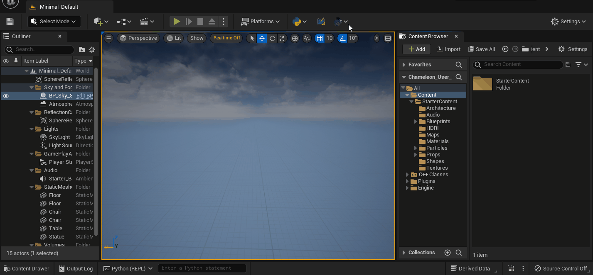

| Type        |    Action  | 
|--------------|-----------|
| assets | select saved assets in content Brower|
| folder      | enter saved folder in Content Brower|
| actors      | select saved actors in level|
| text（python snippet）| execute as python code   |
| chamelon tool json file     | launch the Chameleon tool |

You can modify the python code, and make it better.

---

#### Tool 2 Object Detail Viewer
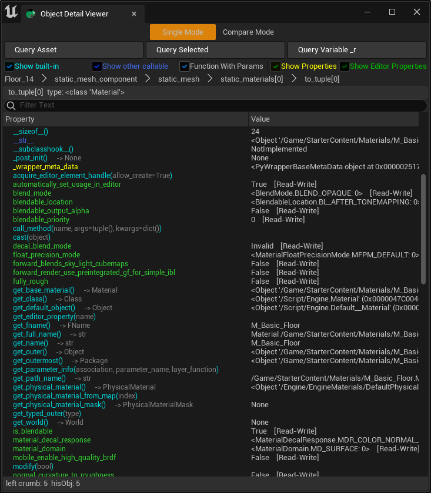

Object Detail Viewer is an inspector Tool for UE object. It shows all the functions and property in any UObject. Double click the property will query the child property. The image above shows the detail values of Floor_14(actor).static_mesh_component.static_mesh.static_materials[0].

In compare mode, the differences of two UObjects will be highlighted. It's very useful for being familiar with all kinds of UObject.

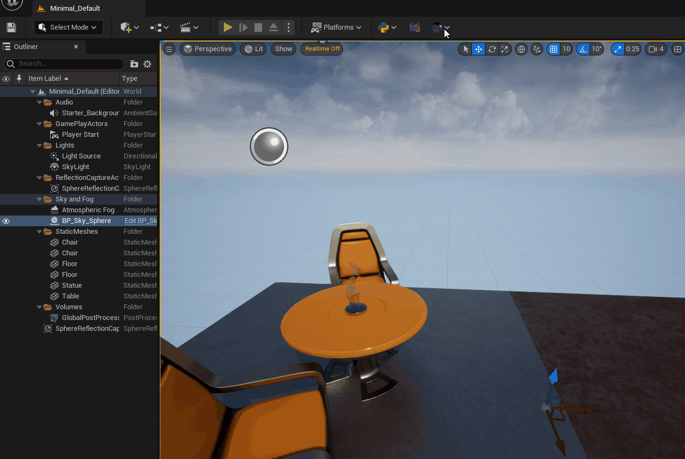

#### Tool 3 Chameleon Gallery

Chameleon Gallery shows the most common widgets, and how to describe them in a json file. All the supported widgets and API documents can be found [here]({filename}ChameleonGallery.md)


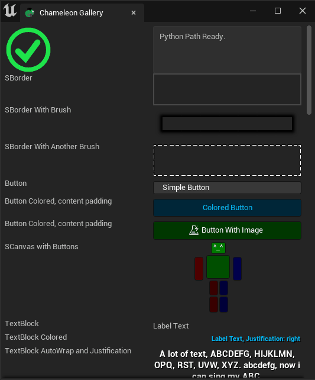


## <a href="https://tacolor.xyz/pages/TAPython.html#documentation">TAPython How to Use</a>


## FAQ
### Q0. Can UE4 use this plugin?
A: Yes, at the beginning this plugin was developed with UE 4.21. We have released this plugin for UE 4.26, 4.27, UE5.0EA, UE5.0Preview1.

### <a href="https://tacolor.xyz/pages/TAPython.html#faq">More FAQ</a>

## Links

- <a href="https://tacolor.xyz/pages/TAPython_Howto.html">How to</a>
- <a href="https://tacolor.xyz/pages/ChameleonGallery.html">Widget Gallery</a>
- <a href="https://tacolor.xyz/pages/ChameleonDataAPI.html">ChameleonData API</a>
- <a href="https://tacolor.xyz/pages/SupportedSlates.html">Supported Slates</a>
- <a href="https://tacolor.xyz/pages/PythonEditorLib.html">Extended Python Editor Lib</a>


## Contributing and feedback 

This Plugin: TAPython is **Free** for use. The [PythonDefaultResource](https://github.com/cgerchenhp/TAPython_DefaultResources)
 is under MIT license.

- Any suggestions and comments are welcome. Please don't hesitate to leave your message.
- If you encounter difficulties or problems. <a href="mailto:chpsemail@gmail.com">EMail me</a> with the problem description, screenshot and the log.
- If you find any English ambiguities or language errors on this page, please feel free to contact me as well.


